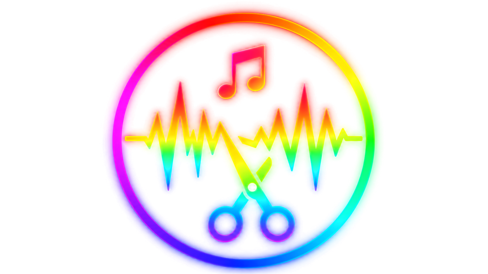
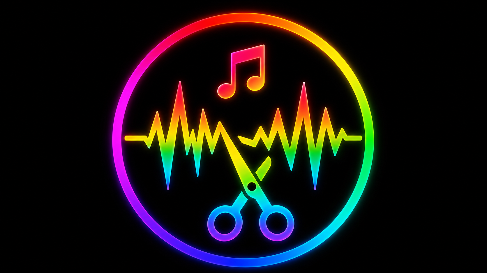
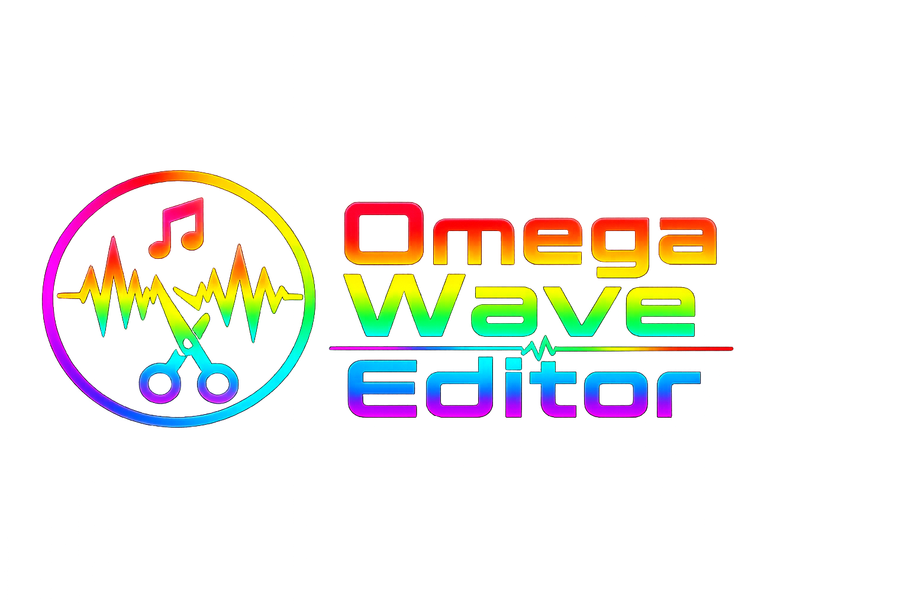
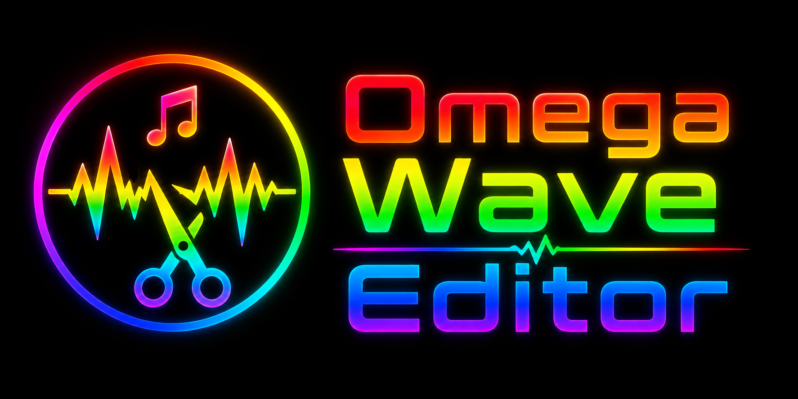

# Omega Wave Editor 🎚️🔊

[](https://github.com/OmegaProjct/Omega-Wave-Editor/releases)
[](#)
[](#)
[](https://electronjs.org)

Ein moderner, plattformübergreifender **Desktop-Audioeditor & DAW** (Digital Audio Workstation) für die schnelle, verlustfreie und kreative Audio-Bearbeitung. 

Der **Omega Wave Editor** kombiniert die Flexibilität moderner Webtechnologien (**Electron, React, TypeScript, TailwindCSS**) mit der Leistung der **Web Audio API** und **FFmpeg**, um eine flüssige Echtzeit-Audiobearbeitung direkt auf Ihrem Rechner zu ermöglichen.

---

## 📸 Screenshots & Impressionen

<p align="center">
  
  
</p>
<p align="center">
  
  
</p>

---

## 🌟 Hauptfunktionen (Core Features)

### 1. Professionelle Multitrack-Timeline
* **Non-destruktives Clip-Handling**: Schneiden, Verschieben, Umbenennen und freies Anordnen von Audio-Regionen auf mehreren Spuren.
* **Echtzeit-Gain-Dragging (Lautstärke-Linie)**: Dynamische Gain-Hüllkurven direkt auf den Audio-Clips verschieben – mit sofortiger akustischer Rückmeldung im laufenden Betrieb.
* **Fade-In & Fade-Out**: Zeichnen Sie flüssige Übergänge per Drag & Drop direkt am Clip-Anfang oder -Ende.
* **Solo / Mute / Pan**: Volle Spurkontrolle für präzises Mischen im Arrangement.
* **Klick-Event-Absorber**: Ein intelligenter Schutz verhindert ungewollte Wiedergabe-Sprünge beim Loslassen von Gain- oder Fade-Punkten.

### 2. Echtzeit DSP-Effekt-Prozessor (Pro Objekt)
Wenden Sie Effekte isoliert und nicht-destruktiv pro Audio-Clip an – berechnet in Echtzeit über die Web Audio API:
* **10-Band Graphic Equalizer**: Präzise Frequenzkorrektur von 60 Hz bis 16 kHz (Boost/Cut um bis zu 15 dB).
* **Kompressor**: Dynamik-Anpassung mit einstellbarem Schwellwert (Threshold) und Kompressions-Verhältnis (Ratio).
* **Hall (Reverb)**: Räumliche Tiefe mit Reglern für Dry/Wet-Mix und Nachhallzeit (Decay).
* **Echo (Delay)**: Rhythmische Echos mit einstellbarer Verzögerungszeit (ms) und Feedback.
* **De-Esser**: Intelligente Dämpfung scharfer Sibilanten (S-, SCH- und Zischlaute) ab 6 kHz.
* **Pitch & Timestretch**: Echtzeit-Veränderung der Abspielgeschwindigkeit und Tonhöhe (Faktor 0.5x bis 2.0x).
* **Preset-Verwaltung**: Speichern und Laden von Effektketten (`.owea`), Kopieren und Einfügen zwischen Objekten, oder Anwenden einer Kette auf alle Audio-Clips.

### 3. Audio Cleaning Suite
Ein dediziertes Werkzeug zur Restaurierung und Verbesserung problematischer Aufnahmen:
* **DeClipper**: Automatische Rekonstruktion übersteuerter (geclippter) Audiosignale.
* **DeNoiser**: Rausch- und Brummreduzierung mit maßgeschneiderten Profilen (z.B. Kamera-Rauschen, Netzbrummen).
* **DeHisser**: Filterung von Bandrauschen und hochfrequentem Zischen.
* **Stereo FX**: Erweiterung der Stereobreite, Balance-Regler und Mono-Downmix.
* **Profil-Export**: Speichern von Cleaning-Profilen als `.owepreset`.

### 4. VST-Plugin-Bridge (Windows)
* **Plugin-Scanner**: Sucht automatisch in den Standardpfaden (`C:\Program Files\VSTPlugins`, `C:\Program Files\Common Files\VST3`, etc.) nach installierten VST2- und VST3-Effekten.
* **Natives UI-Windowing**: Öffnet das Original-Bedienfeld Ihrer Lieblings-Plugins direkt aus dem Wave Editor heraus.

### 5. Aufnahme, Import & Export
* **Integrierter Rekorder**: Audioaufnahmen direkt über Ihr Standard-Mikrofon oder -Interface aufnehmen und sofort in die Timeline einfügen.
* **High-Quality Export (Mixdown)**: Schnelles und präzises Zusammenmischen aller Spuren als MP3, WAV oder FLAC via FFmpeg (unterstützt Mute, Solo und zeitliche Offsets).
* **ID3-Metadaten-Editor**: Editieren Sie Titel, Interpret, Album, Jahr, Genre und Kommentare direkt im Export-Dialog. Volle Windows-Explorer-Kompatibilität durch ID3v2.3-Codierung.
* **Audio Extractor**: Extrahieren Sie die Tonspur aus beliebigen Videodateien mit einem Klick.
* **Datei-Browser**: Schnelles Durchsuchen Ihrer Festplatte mit Dateivorschau direkt in der Seitenleiste.

---

## 🛠️ Technologie & Architektur

Der Omega Wave Editor ist modular und leistungsorientiert aufgebaut:


* **Frontend**: React (18), TypeScript, TailwindCSS, Lucide Icons, Framer Motion.
* **Backend**: Electron (30), Node.js, native System-Verbindungen.
* **Audio-Processing**: Web Audio API (für Echtzeit-Effekte/Wiedergabe) und FFmpeg / FFprobe (für Konvertierung und Mixdown).
* **CI/CD & Releases**: GitHub Actions erzeugen bei jedem Versions-Tag automatisch Builds für alle Betriebssysteme.

---

## 🚀 Installation & Entwicklung

### Voraussetzungen
* **Node.js** (v18 oder höher empfohlen)
* **npm** oder **yarn**

### Lokales Setup
1. Repository klonen:
   ```bash
   git clone https://github.com/OmegaProjct/Omega-Wave-Editor.git
   cd Omega-Wave-Editor
   ```

2. Abhängigkeiten installieren:
   ```bash
   npm install
   ```

3. Entwicklungsmodus starten:
   ```bash
   npm run dev
   ```

### Builds erstellen
Erstellt installierbare Installationspakete und Portable-Versionen im Ordner `dist-bin/`:
```bash
# Produktions-Build vorbereiten
npm run build

# Installationspakete für alle Zielplattformen packen (OS-spezifisch)
npm run dist
```

---

## 📦 Distributionen (Releases)

Für jedes Release werden automatisch folgende Formate gebaut:
* **Windows**:
  * Setup-Installer (`.exe` mit geführter Installation)
  * **Portable-Version** (`Omega-Wave-Editor-Portable-X.Y.Z.exe` – startet sofort ohne Installation, ideal für USB-Sticks)
* **macOS**:
  * DMG-Archiv (`.dmg` mit Drag-to-Applications Unterstützung)
  * ZIP-Archiv (`.zip` für die manuelle Platzierung)
* **Linux**:
  * AppImage (portables, distributionsunabhängiges Format)
  * Debian-Paket (`.deb` für Ubuntu/Debian-Systeme)

---

## ❤️ Projekt unterstützen

Der Omega Wave Editor ist freie Open-Source-Software. Wenn dir das Programm gefällt und du die Weiterentwicklung unterstützen möchtest, freuen wir uns über einen Kaffee via PayPal:

👉 [**Unterstütze uns auf PayPal**](https://www.paypal.com/paypalme/OmegaProjects)

---

*Lizenziert unter der MIT-Lizenz. © 2026 Omega Projects.*
