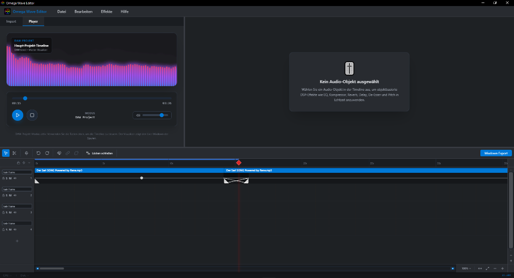
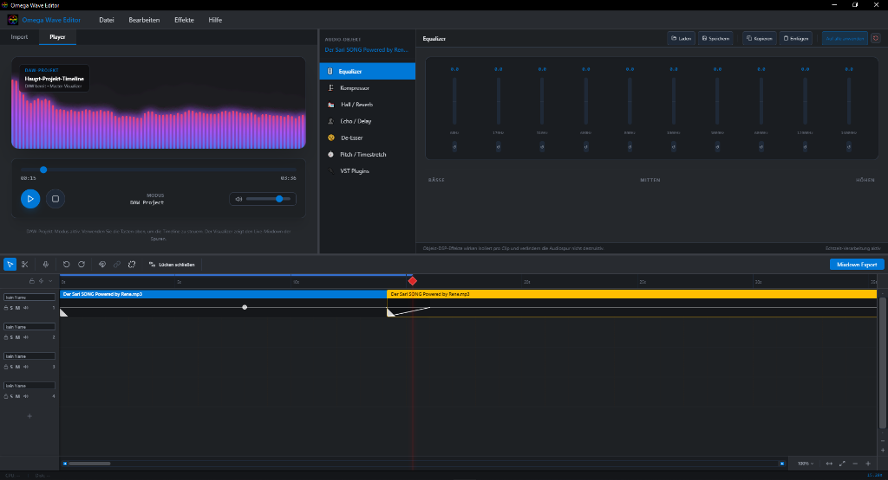
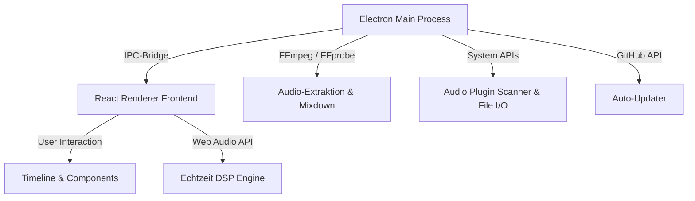

<p align="center">
  
</p>

<p align="center">
  <a href="#english">English Documentation</a> • <a href="#deutsch">Deutsche Dokumentation</a> • <a href="CHANGELOG.md">Changelog</a>
</p>

<p align="center">
  
  
  
  
</p>

---

## Contents / Inhalt

| English | Deutsch |
| --- | --- |
| [Screenshots](#screenshots) | [Screenshots](#screenshots) |
| [English Documentation](#english) | [Deutsche Dokumentation](#deutsch) |
| [Core Features](#en-core-features) | [Hauptfunktionen](#de-hauptfunktionen) |
| [Tech Stack & Architecture](#en-tech-stack--architecture) | [Technologie & Architektur](#de-technologie--architektur) |
| [Installation & Development](#en-installation--development) | [Installation & Entwicklung](#de-installation--entwicklung) |
| [Supported Distribution Packages](#en-supported-distribution-packages) | [Distributionen](#de-distributionen) |
| [Support the Project](#en-support-the-project) | [Projekt unterstützen](#de-projekt-unterstuetzen) |
| [Changelog](CHANGELOG.md) | [Changelog](CHANGELOG.md) |

---

<a name="screenshots"></a>
## 📸 Screenshots

<p align="center">
  
  
</p>

---

<a name="english"></a>
# EN English Documentation

A modern, cross-platform **desktop audio editor & DAW** (Digital Audio Workstation) for fast, non-destructive, and creative audio editing. 

**Omega Wave Editor** combines the flexibility of modern web technologies (**Electron, React, TypeScript, TailwindCSS**) with the power of the **Web Audio API** and **FFmpeg** to provide a fluid, real-time audio editing experience directly on your computer.

---

<a name="en-core-features"></a>
## 🌟 Core Features

### 1. Professional Multitrack Timeline
* **Non-Destructive Clip Handling**: Cut, move, rename, and arrange audio regions freely across multiple tracks.
* **Real-Time Gain Dragging (Volume Line)**: Adjust clip gain envelopes directly on the timeline with instant audio feedback during playback.
* **Fade-In & Fade-Out**: Drag and drop smooth volume transitions directly at the start or end of any audio clip.
* **Solo / Mute / Pan**: Full track controls for precise mixdown blending.
* **Click-Event Absorber**: Intelligent click-propagation defense prevents accidental playback jumps when releasing fades or volume lines.

### 2. Real-Time Object DSP Effects (Per Clip)
Apply non-destructive, isolated effects per audio clip, computed in real time via the Web Audio API:
* **10-Band Graphic Equalizer**: Precise frequency shaping from 60 Hz to 16 kHz (up to ±15 dB boost/cut).
* **Compressor**: Dynamics leveling with adjustable threshold and compression ratio (1:1 to 20:1).
* **Reverb (Hall)**: Add spatial depth with adjustable dry/wet mix and decay time (0.1s to 8.0s).
* **Delay (Echo)**: Rhythmic delay taps with adjustable feedback and time (10ms to 2000ms).
* **De-Esser**: Dynamically suppress sharp sibilants (S, SH, and Z sounds) above 6 kHz.
* **Pitch & Timestretch**: Adjust playback speed and pitch in real time (factor 0.5x to 2.0x).
* **Preset Manager**: Save and load effect chains (`.owea`), copy/paste settings between clips, or apply the current chain to all clips.

### 3. Audio Cleaning Suite
A dedicated tool for restoring and enhancing low-quality or noisy recordings:
* **DeClipper**: Automatically reconstruct digitally clipped/distorted audio signals.
* **DeNoiser**: Attenuate background noise and hum using tailored profiles (e.g., camera noise, mains hum).
* **DeHisser**: High-frequency filter for tape hiss and high-end static.
* **Stereo FX**: Enhance stereo width, adjust pan balance, and create mono downmixes.
* **Preset Export**: Save cleaning configurations as `.owepreset` files.

### 4. VST2 & VSTi Plugin Host & Store (Windows Native, macOS/Linux Fallback)
* **Plugin Scanner**: Automatically scans default installation paths on Windows, macOS, and Linux for VST2, VST3, AU, and LV2 audio plugins.
* **VST2 & VSTi Host (Windows)**: Load and route VST2 effects (compressors, EQs, delays) and VST Instruments (synthesizers, samplers) in real-time. Zero-copy audio/MIDI routing via SharedArrayBuffer ring buffers and a dedicated high-priority native C++ audio thread. Opens native plugin GUI editors inside floating OS windows.
* **MIDI Pro & Learn Integration**: Play VST instruments live with extremely low latency. Connect knobs/sliders of your MIDI controllers to VST parameters instantly via the built-in MIDI Learn toggle.
* **Two-Way MIDI & DJ Navigation**: Support for active MIDI controller feedback (Midi Out). Map Jog-Wheels/dials to timeline scrolling, scrubbing, and horizontal zoom.
* **Free VST Store**: Curated built-in shop in the side panel offering direct downloads and automated installation of free pro-quality VST effects and synths (Vital, Surge XT, Dexed, etc.).

### 5. Recording, Import & Export
* **Built-in Recorder**: Record audio directly from your default mic or audio interface and insert it instantly into the timeline.
* **High-Quality Export (Mixdown)**: Mix down all tracks to MP3, WAV, or FLAC via FFmpeg (respects mute, solo, and delay offsets).
* **ID3 Tag Editor**: Edit title, artist, album, year, genre, and comments within the export window. Features full Windows Explorer compatibility (ID3v2.3 tagging).
* **Audio Extractor**: Extract audio tracks from any video file with a single click.
* **File Browser**: Browse local drives with audio previewing in the side panel.

---

<a name="en-tech-stack--architecture"></a>
## 🛠️ Tech Stack & Architecture



* **Frontend**: React (18), TypeScript, TailwindCSS, Lucide Icons, Framer Motion.
* **Backend**: Electron (30), Node.js, native system bridges.
* **Audio Engines**: Web Audio API (real-time playback/effects), FFmpeg & FFprobe (conversions/mixdown).
* **CI/CD**: GitHub Actions workflows compile builds on every tag push.

---

<a name="en-installation--development"></a>
## 🚀 Installation & Development

### Prerequisites
* **Node.js** (v18 or higher recommended)
* **npm** or **yarn**

### Local Setup
1. Clone the repository:
   ```bash
   git clone https://github.com/OmegaProjct/Omega-Wave-Editor.git
   cd Omega-Wave-Editor
   ```
2. Install dependencies:
   ```bash
   npm install
   ```
3. Start development server:
   ```bash
   npm run dev
   ```

### Compile Releases
Creates installable files and portable binaries under `dist-bin/`:
```bash
# Build frontend assets
npm run build

# Pack installers (OS-specific)
npm run dist
```

---

<a name="en-supported-distribution-packages"></a>
## 📦 Supported Distribution Packages

Every release automatically compiles the following:
* **Windows**:
  * Setup Installer (`.exe`)
  * **Portable Binary** (`Omega-Wave-Editor-Portable-X.Y.Z.exe` – standalone, no installation required)
* **macOS**:
  * DMG Image (`.dmg`)
  * ZIP Archive (`.zip`)
* **Linux**:
  * AppImage (portable format)
  * Debian Package (`.deb`)

---

<a name="en-support-the-project"></a>
## ❤️ Support the Project

Omega Wave Editor is free, open-source software. If you find the program useful and would like to support its development, feel free to buy us a coffee via PayPal:

👉 [**Support us on PayPal**](https://www.paypal.com/paypalme/OmegaProjects)

---

<a name="deutsch"></a>
# DE Deutsche Dokumentation

Ein moderner, plattformübergreifender **Desktop-Audioeditor & DAW** (Digital Audio Workstation) für die schnelle, verlustfreie und kreative Audio-Bearbeitung. 

Der **Omega Wave Editor** kombiniert die Flexibilität moderner Webtechnologien (**Electron, React, TypeScript, TailwindCSS**) mit der Leistung der **Web Audio API** und **FFmpeg**, um eine flüssige Echtzeit-Audiobearbeitung direkt auf Ihrem Rechner zu ermöglichen.

---

<a name="de-hauptfunktionen"></a>
## 🌟 Hauptfunktionen (Core Features)

### 1. Professionelle Multitrack-Timeline
* **Non-destruktives Clip-Handling**: Schneiden, Verschieben, Umbenennen und freies Anordnen von Audio-Regionen auf mehreren Spuren.
* **Echtzeit-Gain-Dragging (Lautstärke-Linie)**: Dynamische Gain-Hüllkurven direkt auf den Audio-Clips verschieben – mit sofortiger akustischer Rückmeldung im laufenden Betrieb.
* **Fade-In & Fade-Out**: Zeichnen Sie flüssige Übergänge per Drag & Drop direkt am Clip-Anfang oder -Ende.
* **Solo / Mute / Pan**: Volle Spurkontrolle für präzises Mischen im Arrangement.
* **Klick-Event-Absorber**: Ein intelligenter Schutz verhindert ungewollte Wiedergabe-Sprünge beim Loslassen von Gain- oder Fade-Punkten.

### 2. Echtzeit DSP-Effekt-Prozessor (Pro Objekt)
Wenden Sie Effekte isoliert und nicht-destruktiv pro Audio-Clip an – berechnet in Echtzeit über die Web Audio API:
* **10-Band Graphic Equalizer**: Präzise Frequenzkorrektur von 60 Hz bis 16 kHz (Boost/Cut um bis zu 15 dB).
* **Kompressor**: Dynamik-Anpassung mit einstellbarem Schwellwert (Threshold) und Kompressions-Verhältnis (Ratio).
* **Hall (Reverb)**: Räumliche Tiefe mit Reglern für Dry/Wet-Mix und Nachhallzeit (Decay).
* **Echo (Delay)**: Rhythmische Echos mit einstellbarer Verzögerungszeit (ms) und Feedback.
* **De-Esser**: Intelligente Dämpfung scharfer Sibilanten (S-, SCH- und Zischlaute) ab 6 kHz.
* **Pitch & Timestretch**: Echtzeit-Veränderung der Abspielgeschwindigkeit und Tonhöhe (Faktor 0.5x bis 2.0x).
* **Preset-Verwaltung**: Speichern und Laden von Effektketten (`.owea`), Kopieren und Einfügen zwischen Objekten, oder Anwenden einer Kette auf alle Audio-Clips.

### 3. Audio Cleaning Suite
Ein dediziertes Werkzeug zur Restaurierung und Verbesserung problematischer Aufnahmen:
* **DeClipper**: Automatische Rekonstruktion übersteuerter (geclippter) Audiosignale.
* **DeNoiser**: Rausch- und Brummreduzierung mit maßgeschneiderten Profilen (z.B. Kamera-Rauschen, Netzbrummen).
* **DeHisser**: Filterung von Bandrauschen und hochfrequentem Zischen.
* **Stereo FX**: Erweiterung der Stereobreite, Balance-Regler und Mono-Downmix.
* **Profil-Export**: Speichern von Cleaning-Profilen als `.owepreset`.

### 4. VST2 & VSTi Plugin-Host & Store (Windows Nativ, macOS/Linux Fallback)
* **Plugin-Scanner**: Sucht automatisch in den Standardpfaden auf Windows, macOS und Linux nach installierten VST2-, VST3-, AU- und LV2-Audio-Plugins.
* **VST2 & VSTi Host (Windows)**: Laden und Routen von VST2-Effekten (Kompressoren, EQs, Delays) und VST-Instrumenten (Synthesizer, Sampler) in Echtzeit. Latenzfreies Audio/MIDI-Routing via SharedArrayBuffer-Ringpuffer und eigenem C++ High-Priority Audio-Thread. Öffnet native Plugin-Editoren in separaten Betriebssystem-Fenstern.
* **MIDI Pro & Learn Integration**: Live-Spielen von Synthesizern über angeschlossene Keyboards. Verbinden von Hardware-Reglern mit VST-Parametern per einfachem MIDI-Learn Klick.
* **Zwei-Wege-MIDI & DJ Navigation**: Unterstützung für aktives MIDI-Controller-Feedback (Midi Out). Mappen von Jog-Wheels/Drehrädern auf Timeline-Scrollen, Scrubben und horizontales Zoomen.
* **Kostenloser VST Store**: Kuriertes In-App-Verzeichnis in der Seitenleiste für den direkten Download und automatischen Import exzellenter freier VSTs und Synths (Vital, Surge XT, Dexed etc.).

### 5. Aufnahme, Import & Export
* **Integrierter Rekorder**: Audioaufnahmen direkt über Ihr Standard-Mikrofon oder -Interface aufnehmen und sofort in die Timeline einfügen.
* **High-Quality Export (Mixdown)**: Schnelles und präzises Zusammenmischen aller Spuren als MP3, WAV oder FLAC via FFmpeg (unterstützt Mute, Solo und zeitliche Offsets).
* **ID3-Metadaten-Editor**: Editieren Sie Titel, Interpret, Album, Jahr, Genre und Kommentare direkt im Export-Dialog. Volle Windows-Explorer-Kompatibilität durch ID3v2.3-Codierung.
* **Audio Extractor**: Extrahieren Sie die Tonspur aus beliebigen Videodateien mit einem Klick.
* **Datei-Browser**: Schnelles Durchsuchen Ihrer Festplatte mit Dateivorschau direkt in der Seitenleiste.

---

<a name="de-technologie--architektur"></a>
## 🛠️ Technologie & Architektur

* **Frontend**: React (18), TypeScript, TailwindCSS, Lucide Icons, Framer Motion.
* **Backend**: Electron (30), Node.js, native System-Verbindungen.
* **Audio-Processing**: Web Audio API (für Echtzeit-Effekte/Wiedergabe) und FFmpeg / FFprobe (für Konvertierung und Mixdown).
* **CI/CD & Releases**: GitHub Actions erzeugen bei jedem Versions-Tag automatisch Builds für alle Betriebssysteme.

---

<a name="de-installation--entwicklung"></a>
## 🚀 Installation & Entwicklung

### Voraussetzungen
* **Node.js** (v18 oder höher empfohlen)
* **npm** oder **yarn**

### Lokales Setup
1. Repository klonen:
   ```bash
   git clone https://github.com/OmegaProjct/Omega-Wave-Editor.git
   cd Omega-Wave-Editor
   ```
2. Abhängigkeiten installieren:
   ```bash
   npm install
   ```
3. Entwicklungsmodus starten:
   ```bash
   npm run dev
   ```

### Builds erstellen
Erstellt installierbare Installationspakete und Portable-Versionen im Ordner `dist-bin/`:
```bash
# Produktions-Build vorbereiten
npm run build

# Installationspakete für alle Zielplattformen packen (OS-spezifisch)
npm run dist
```

---

<a name="de-distributionen"></a>
## 📦 Distributionen (Releases)

Für jedes Release werden automatisch folgende Formate gebaut:
* **Windows**:
  * Setup-Installer (`.exe` mit geführter Installation)
  * **Portable-Version** (`Omega-Wave-Editor-Portable-X.Y.Z.exe` – startet sofort ohne Installation, ideal für USB-Sticks)
* **macOS**:
  * DMG-Archiv (`.dmg` mit Drag-to-Applications Unterstützung)
  * ZIP-Archiv (`.zip` für die manuelle Platzierung)
* **Linux**:
  * AppImage (portables, distributionsunabhängiges Format)
  * Debian-Paket (`.deb` für Ubuntu/Debian-Systeme)

---

<a name="de-projekt-unterstuetzen"></a>
## ❤️ Projekt unterstützen

Der Omega Wave Editor ist freie Open-Source-Software. Wenn dir das Programm gefällt und du die Weiterentwicklung unterstützen möchtest, freuen wir uns über einen Kaffee via PayPal:

👉 [**Unterstütze uns auf PayPal**](https://www.paypal.com/paypalme/OmegaProjects)

---

*Lizenziert unter der MIT-Lizenz. © 2026 Omega Projects.*
