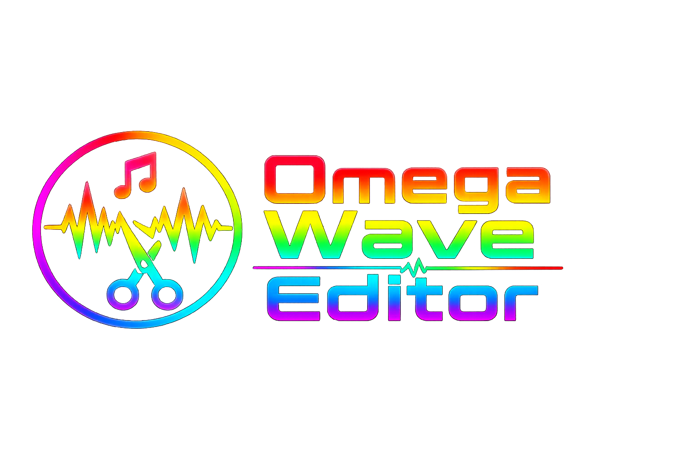
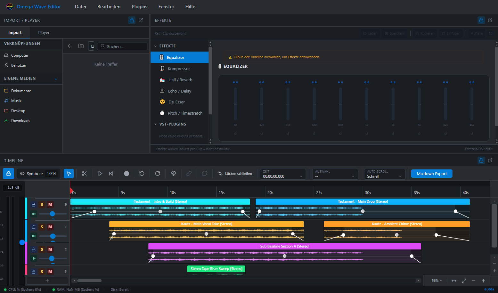
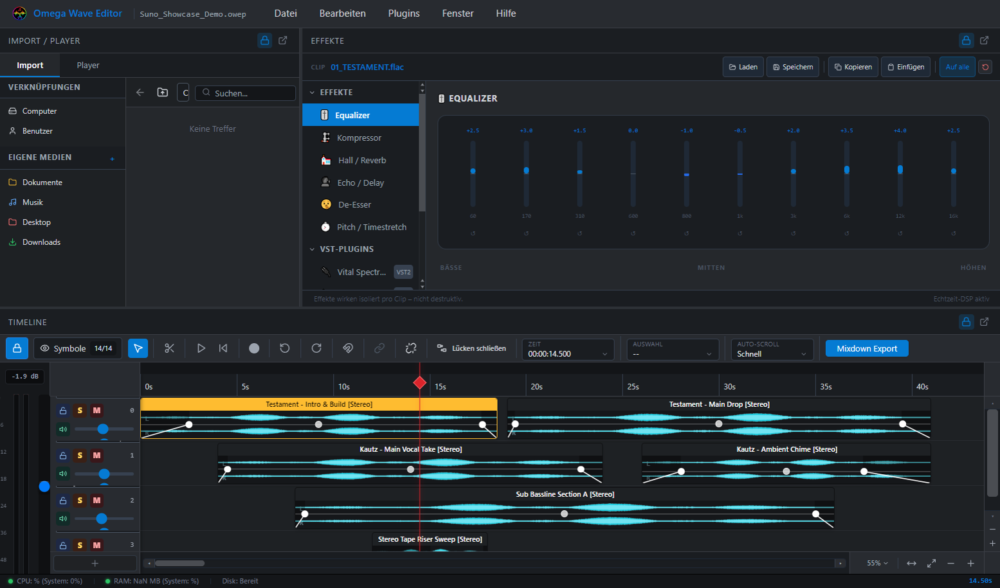
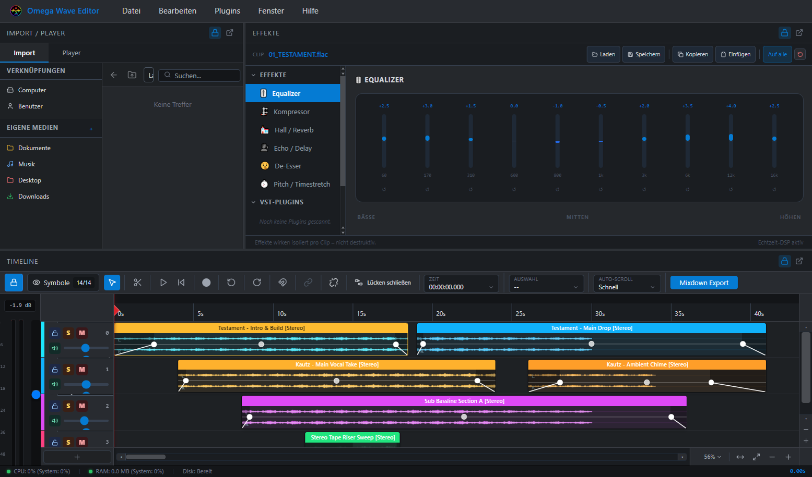
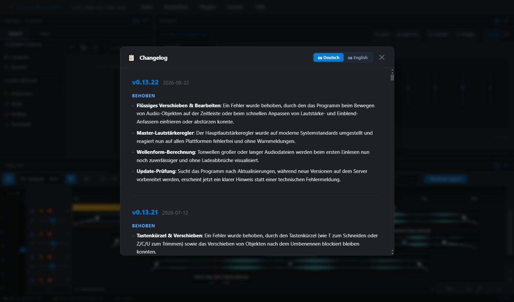
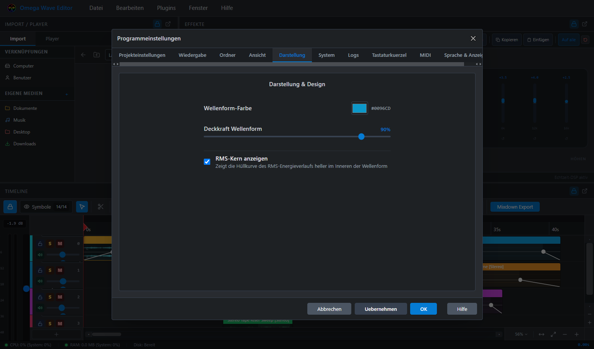
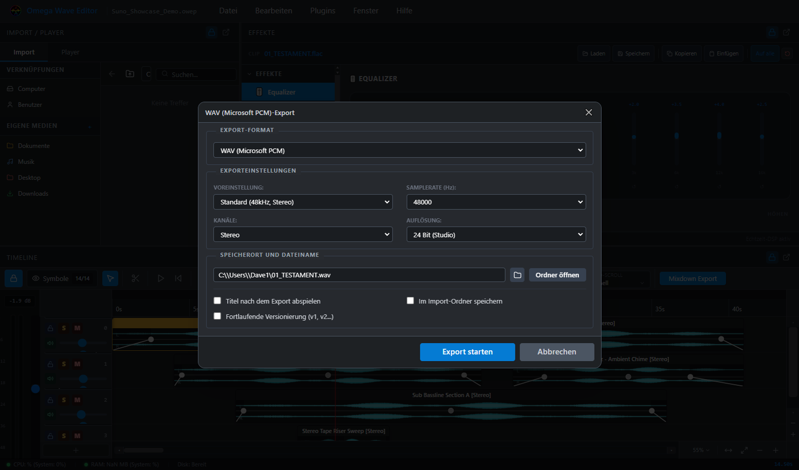
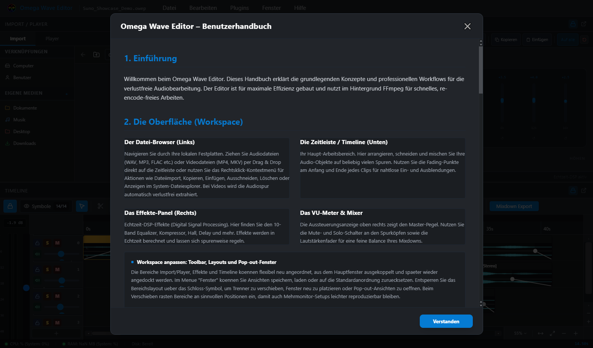
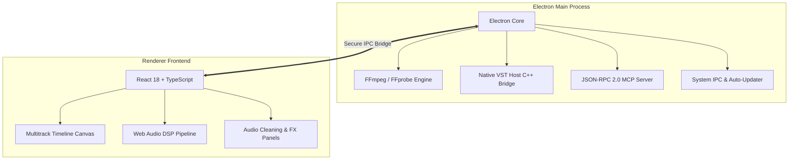

<p align="center">
  
</p>

<h3 align="center">Modern, High-Performance Multitrack Audio Editor, DAW & AI Audio Core</h3>

<p align="center">
  <a href="#english">English Documentation</a> • 
  <a href="#deutsch">Deutsche Dokumentation</a> • 
  <a href="CHANGELOG.md">User Changelog</a> • 
  <a href="CHANGELOG_DEV.md">Dev Changelog</a> • 
  <a href="CONTRIBUTING.md">Contributing</a>
</p>

<p align="center">
  <a href="https://github.com/OmegaProjct/Omega-Wave-Editor/releases/latest"></a>
  
  
  
  <a href="LICENSE"></a>
</p>

---

## 📑 Table of Contents / Inhaltsverzeichnis

| 🇬🇧 English | 🇩🇪 Deutsch |
| :--- | :--- |
| ⚡ [Quick Download](#quick-download) | ⚡ [Schnelldownload](#schnelldownload) |
| 📸 [Screenshots & Workflow](#screenshots) | 📸 [Screenshots & Arbeitsbereich](#screenshots) |
| 🌟 [Core Features](#en-core-features) | 🌟 [Hauptfunktionen](#de-hauptfunktionen) |
| 🤖 [AI Core & MCP Server](#en-mcp-server) | 🤖 [KI-Core & MCP-Server](#de-mcp-server) |
| 🛠️ [Architecture & Tech Stack](#en-tech-stack) | 🛠️ [Architektur & Tech-Stack](#de-tech-stack) |
| 💻 [Development & Setup](#en-development) | 💻 [Entwicklung & Setup](#de-entwicklung) |
| 📜 [Changelogs (User & Dev)](#en-changelog) | 📜 [Versionsverlauf (Changelogs)](#de-changelog) |
| ❤️ [Support the Project](#en-support) | ❤️ [Projekt unterstützen](#de-support) |

---

<a name="quick-download"></a>
<a name="schnelldownload"></a>
## ⚡ Quick Download / Schnelldownload

Get the latest stable version of **Omega Wave Editor** directly from our [Releases Page](https://github.com/OmegaProjct/Omega-Wave-Editor/releases/latest):

| Operating System | Recommended Installer | Standalone / Alternative |
| :--- | :--- | :--- |
| **🪟 Windows** (x64) | [**Download Setup (.exe)**](https://github.com/OmegaProjct/Omega-Wave-Editor/releases/latest) | [**Download Portable (.exe)**](https://github.com/OmegaProjct/Omega-Wave-Editor/releases/latest) |
| **🍎 macOS** (Apple Silicon / Intel) | [**Download DMG Image (.dmg)**](https://github.com/OmegaProjct/Omega-Wave-Editor/releases/latest) | [**Download ZIP Archive (.zip)**](https://github.com/OmegaProjct/Omega-Wave-Editor/releases/latest) |
| **🐧 Linux** (x64) | [**Download AppImage**](https://github.com/OmegaProjct/Omega-Wave-Editor/releases/latest) | [**Download Debian (.deb)**](https://github.com/OmegaProjct/Omega-Wave-Editor/releases/latest) |

---

<a name="screenshots"></a>
## 📸 Screenshots & Visual Tour

| 🎛️ Multitrack Studio Workspace | 🎚️ 10-Band Graphic EQ & DSP Effects |
| :---: | :---: |
|  |  |
| *Non-destructive multitrack arrangement with colored cuts, volume envelopes & fade handles.* | *Real-time per-clip DSP chain with 10-band EQ, Dynamics Compressor & Reverb.* |

| 🏪 Curated In-App VST Plugin Store | 📜 In-App Changelog & Release Notes |
| :---: | :---: |
|  |  |
| *1-click freeware discovery and automatic installation (Vital, Surge XT, Dexed, Kotelnikov).* | *Modern bilingual changelog with color-coded category badges and user-friendly notes.* |

| 🎨 Appearance & Waveform Customization | 📦 High-Resolution Mixdown & ID3 Studio |
| :---: | :---: |
|  |  |
| *Personalize waveform colors, opacity, RMS energy core, and half-waveform views.* | *Lossless WAV/FLAC & MP3 export with 24-bit Studio mastering & embedded ID3 tags.* |

<p align="center">
  
  <br />
  <em>Integrated bilingual reference manual explaining workflows, hotkeys, and modular window docking.</em>
</p>

---

<a name="english"></a>
# 🇬🇧 English Documentation

**Omega Wave Editor** is a fast, versatile, non-destructive multitrack audio workstation and Digital Audio Workstation (DAW). It unifies modern desktop performance with real-time DSP audio processing, native VST2/VSTi plugin hosting, an integrated free VST store, and a full **Model Context Protocol (MCP) server** for AI-assisted editing and headless automated workflows.

---

<a name="en-core-features"></a>
## 🌟 Core Highlights

### 1. Multitrack Timeline & Fluid Audio Manipulation
* **Non-Destructive Clip Arrangement**: Freely move, trim, cut (Hotkey `T`), duplicate, and organize audio regions across unlimited tracks.
* **Inline Clip Renaming**: Rename audio objects directly on the timeline via inline header editing, context menu, or by pressing `F2`.
* **Real-Time Gain Envelopes**: Adjust volume curves directly on the audio clip with live auditory feedback during playback.
* **Permanent Fade Handles**: Instant drag-and-drop volume fade-ins and fade-outs at clip borders.
* **Playhead-Centered Zoom & Fluid Navigation**: High-performance waveform rendering with playhead-anchored zooming and sub-millisecond scrolling.
* **Custom Appearance**: Personalize waveform colors, opacity, RMS core visibility, and switch between dual-sided and half-waveform views.

### 2. Real-Time Object DSP Effects Suite (Per Clip)
Every individual audio object has its own isolated, real-time effects chain computed via the Web Audio API:
* **10-Band Graphic Equalizer**: Precise frequency boosting and cutting (60 Hz – 16 kHz, up to ±15 dB).
* **Dynamics Compressor**: Pro-grade threshold, ratio (1:1 to 20:1), attack, and release controls.
* **Spatial Reverb & Echo Delay**: Smooth decay times (0.1s to 8.0s) and rhythmic feedback echo taps.
* **De-Esser**: Intelligent sibilance suppression above 6 kHz for crisp, non-harsh vocals.
* **Time-Stretching & Pitch Shifting**: Non-destructive speed and pitch adjustments (0.5x to 2.0x).
* **Preset Library (`.owea`)**: Save, load, and copy effect chains between clips or apply them globally.

### 3. Audio Cleaning & Restoration Suite
A dedicated suite for repairing and enhancing noisy, distorted, or legacy recordings:
* **DeClipper**: Algorithmic reconstruction of digitally clipped and overloaded waveforms.
* **DeNoiser**: Tailored background hum, electrical buzz, and room noise suppression.
* **DeHisser**: High-frequency static and tape hiss reduction.
* **Stereo Widener & Balancing**: Stereo field expansion, pan balancing, and true mono downmixing.

### 4. VST2 & VSTi Plugin Host & In-App Store
* **Native VST2 Host (Windows)**: Run 64-bit VST2 audio effects and VSTi synthesizers with ultra-low latency through dedicated C++ ring buffers.
* **Floating Plugin GUIs**: Open and interact with original native plugin interfaces.
* **MIDI Pro & Learn Engine**: Play virtual instruments live with MIDI keyboards; map hardware knobs to plugin parameters with 1-click MIDI Learn.
* **Free VST Store**: Curated sidebar catalog offering 1-click downloads and automatic installation of top-tier free plugins (Vital, Surge XT, Dexed, etc.).

---

<a name="en-mcp-server"></a>
## 🤖 AI & Automation Core (Model Context Protocol / MCP Server)
Omega Wave Editor includes a built-in JSON-RPC 2.0 MCP server (`src/main/mcpServer.ts`), allowing AI assistants (Antigravity, Claude Desktop, Cursor) and automated scripts to control the editor:
* **Project Management**: `project_create`, `project_load`, `project_save`, `project_export`.
* **Track & Clip Operations**: `track_add`, `track_remove`, `clip_import`, `clip_split`, `clip_adjust_gain`.
* **Batch Execution**: Run multi-step recipes and audio transformations headless without GUI overhead.

---

<a name="en-tech-stack"></a>
## 🛠️ Architecture & Tech Stack


```mermaid
graph TD
    subgraph Electron Main Process
        A[Electron Core] --> B[FFmpeg / FFprobe Engine]
        A --> C[Native VST Host C++ Bridge]
        A --> D[JSON-RPC 2.0 MCP Server]
        A --> E[System IPC & Auto-Updater]
    end

    subgraph Renderer Frontend
        F[React 18 + TypeScript] --> G[Multitrack Timeline Canvas]
        F --> H[Web Audio DSP Pipeline]
        F --> I[Audio Cleaning & FX Panels]
    end

    A <==>|Secure IPC Bridge| F
```

* **Frontend**: React 18, TypeScript, TailwindCSS, Lucide Icons, Canvas API.
* **Backend**: Electron 30, Node.js, native C++ addon (`omega-vst-host`).
* **Audio Engines**: Web Audio API (real-time playback/effects), FFmpeg & FFprobe (mixdown & conversion).
* **Automation**: Model Context Protocol (MCP) Server for AI agent workflows.

---

<a name="en-development"></a>
## 💻 Development & Building

### Prerequisites
* **Node.js**: `v18.0.0` or higher
* **npm**: `v9.0.0` or higher
* **C++ Build Tools**: Required only if modifying the native VST host on Windows (Visual Studio Build Tools / CMake).

### Quick Start
```bash
# 1. Clone the repository
git clone https://github.com/OmegaProjct/Omega-Wave-Editor.git
cd Omega-Wave-Editor

# 2. Install dependencies
npm install

# 3. Start development server
npm run dev
```

### Type Checking & Building
```bash
# Typecheck TypeScript code
npm run typecheck

# Build frontend & production assets
npm run build
```

---

<a name="en-changelog"></a>
## 📜 Changelogs & Release History

We maintain two separate, dedicated changelogs to cater to both users and contributors:
* 👉 [**User Changelog (`CHANGELOG.md`)**](CHANGELOG.md) – End-user focused, readable overview of all new features, improvements, and fixes across all 98 releases.
* 👉 [**Developer Changelog (`CHANGELOG_DEV.md`)**](CHANGELOG_DEV.md) – Detailed technical log containing architectural changes, IPC handlers, low-level data structures, and code refactorings.

---

<a name="en-support"></a>
## ❤️ Support the Project

Omega Wave Editor is free, open-source software under the MIT License. If you enjoy using the editor and would like to support ongoing development, donations are gratefully accepted via PayPal:

👉 [**Support us on PayPal**](https://www.paypal.com/paypalme/OmegaProjects)

---

<a name="deutsch"></a>
# 🇩🇪 Deutsche Dokumentation

**Omega Wave Editor** ist ein moderner, plattformübergreifender **Multitrack-Audioeditor & DAW** (Digital Audio Workstation) für schnelles, verlustfreies und kreatives Arbeiten mit Audiodaten. 

Er kombiniert die Flexibilität moderner Webtechnologien (**Electron, React, TypeScript, TailwindCSS**) mit der Leistungsfähigkeit der **Web Audio API**, **FFmpeg**, einem nativen **VST2/VSTi-Host** sowie einem integrierten **MCP-Server** zur intelligenten Automatisierung und KI-gestützten Audiobearbeitung.

---

<a name="de-hauptfunktionen"></a>
## 🌟 Hauptfunktionen (Feature-Übersicht)

### 1. Professionelle Mehrspur-Zeitleiste (Multitrack Timeline)
* **Verlustfreie Audio-Arrangements**: Tonstücke frei auf Spuren verschieben, trimmen, schneiden (Taste `T`) und duplizieren.
* **Direktes Umbenennen von Objekten**: Audio-Objekte direkt in der Spurtitelleiste, per Rechtsklick oder Taste `F2` umbenennen.
* **Echtzeit-Lautstärkelinien (Gain-Envelopes)**: Lautstärken direkt auf dem Tonstück mit sofortiger akustischer Rückmeldung anpassen.
* **Permanente Ein-/Ausblend-Anfasser**: Runde Fade-Punkte an Clip-Rändern für sofortiges Ziehen weicher Lautstärkeübergänge.
* **Abspielkopf-zentrierter Zoom & flüssige Navigation**: Schnelle Wellenform-Darstellung, bei der der Abspielkopf beim Zoomen stets im Blickfeld bleibt.
* **Individuelle Optik**: Einstellbare Wellenform-Farben, Deckkraft, RMS-Kern-Anzeige und kompakte Halbe-Wellenform-Ansicht.

### 2. Echtzeit-Effekte pro Audio-Objekt (DSP Suite)
Jedes einzelne Tonstück besitzt eine eigene, nicht-destruktive Effektkette in Studioqualität:
* **10-Band Grafischer Equalizer**: Präzise Frequenzanpassung von 60 Hz bis 16 kHz (bis zu ±15 dB Boost/Cut).
* **Kompressor**: Dynamik-Kontrolle mit Schwellwert, Ratio (1:1 bis 20:1), Attack und Release.
* **Hall (Reverb) & Echo (Delay)**: Räumlicher Raumklang (0,1s bis 8,0s) und anpassbare rhythmische Echo-Wiederholungen.
* **De-Esser**: Dämpft scharfe Sibilanten (S- und Zischlaute) ab 6 kHz für weiche Sprachaufnahmen.
* **Pitch & Tempo (Timestretch)**: Abspielgeschwindigkeit und Tonhöhe unabhängig voneinander im Bereich von 0.5x bis 2.0x anpassen.
* **Effekt-Presets (`.owea`)**: Speichern und Laden kompletter Effektketten sowie schnelles Übertragen auf andere Clips.

### 3. Audio Cleaning Suite (Restaurierung)
Spezialwerkzeuge zur Beseitigung von Störgeräuschen und Restaurierung alter Aufnahmen:
* **DeClipper**: Rekonstruiert übersteuerte, digital geclippte Audiospitzen.
* **DeNoiser**: Beseitigt Netzbrummen, Lüfter- und Umgebungsgeräusche über gezielte Profile.
* **DeHisser**: Filtert Tonbandrauschen und hochfrequentes Zischen heraus.
* **Stereo-Optimierung**: Verbreiterung der Stereobasis, Balanceregler und Mono-Downmix.

### 4. VST2 & VSTi Plugin-Host & Kostenloser Store
* **Nativer VST2-Host (Windows)**: 64-Bit VST2-Effekte und VSTi-Instrumente latenzfrei über optimierte C++ Ringpuffer einbinden.
* **Originale Plugin-Bedienoberflächen**: Öffnet native Plugin-Oberflächen in separaten Fenstern.
* **MIDI Pro & Learn**: Synthesizer live per MIDI-Keyboard spielen und Regler per 1-Klick MIDI Learn verknüpfen.
* **Kostenloser In-App VST Store**: Kuriertes Verzeichnis in der Seitenleiste für den direkten 1-Klick-Download beliebter kostenloser Qualitäts-Plugins (Vital, Surge XT, Dexed etc.).

---

<a name="de-mcp-server"></a>
## 🤖 KI & Automations-Kern (Model Context Protocol / MCP-Server)
Der Omega Wave Editor enthält einen vollwertigen JSON-RPC 2.0 MCP-Server (`src/main/mcpServer.ts`), mit dem KI-Assistenten (Claude Desktop, Antigravity, Skripte) den Editor steuern können:
* **Projektverwaltung**: `project_create`, `project_load`, `project_save`, `project_export`.
* **Spur- & Schnittbefehle**: `track_add`, `track_remove`, `clip_import`, `clip_split`, `clip_adjust_gain`.
* **Automatisierte Stapelverarbeitung**: Mehrstufige Audio-Bearbeitungen headless im Hintergrund ausführen.

---

<a name="de-tech-stack"></a>
## 🛠️ Technologie & Architektur

* **Frontend**: React 18, TypeScript, TailwindCSS, Lucide Icons, Canvas API.
* **Backend**: Electron 30, Node.js, natives C++ Addon (`omega-vst-host`).
* **Audio-Processing**: Web Audio API (Echtzeit-Effekte/Wiedergabe) und FFmpeg / FFprobe (Konvertierung & Mixdown).
* **CI/CD & Builds**: Automatische Multi-Plattform-Builds über GitHub Actions bei jedem Versions-Tag.

---

<a name="de-entwicklung"></a>
## 🚀 Installation & Lokale Einrichtung

```bash
# Repository klonen
git clone https://github.com/OmegaProjct/Omega-Wave-Editor.git
cd Omega-Wave-Editor

# Abhängigkeiten installieren
npm install

# Entwicklungsmodus starten
npm run dev
```

---

<a name="de-changelog"></a>
## 📜 Versionsverlauf & Changelogs

Das Projekt pflegt eine saubere Trennung zwischen Anwender- und Entwicklerdokumentation:
* 👉 [**Benutzer-Changelog (`CHANGELOG.md`)**](CHANGELOG.md) – Alle Neuerungen, Verbesserungen und Korrekturen in klarer Anwendersprache.
* 👉 [**Entwickler-Changelog (`CHANGELOG_DEV.md`)**](CHANGELOG_DEV.md) – Vollständige technische Dokumentation mit internen IPC-Endpunkten, Modul-Refactorings und Datenstrukturen.

---

<a name="de-support"></a>
## ❤️ Projekt unterstützen

Der **Omega Wave Editor** ist freie Open-Source-Software unter der MIT-Lizenz. Wenn Ihnen das Programm gefällt und Sie die Weiterentwicklung unterstützen möchten, freuen wir uns über einen Kaffee via PayPal:

👉 [**Omega Projects auf PayPal unterstützen**](https://www.paypal.com/paypalme/OmegaProjects)

---

## 📄 Lizenz

Dieses Projekt ist unter der **MIT-Lizenz** lizenziert. Weitere Details finden Sie in der Datei [LICENSE](LICENSE).

*© 2026 Omega Projects. Entwickelt mit Leidenschaft für Audioproduzenten und Musiker.*
