# Omega Wave Editor - Wellenform-Dokumentation (Codex)

Dieses Dokument führt die Vergleiche, Diskussionen und die finale Fehlerbehebung der Wellenformdarstellung und des Zoom-Rendering-Fehlers zusammen.

---

## 🖼️ Wellenform-Vergleiche und Screenshots (Galerie)

Die folgenden Bilder zeigen die Wellenform-Unterschiede (normal vs. FLAC), Reaper-Vergleiche und den Rendering-Fehler:

- **media__1781332249296.png**:
  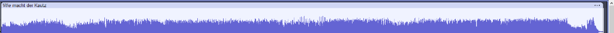

- **media__1781332272076.png**:
  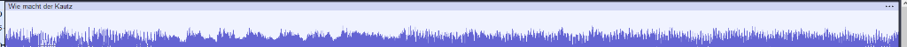

- **media__1781332283325.png**:
  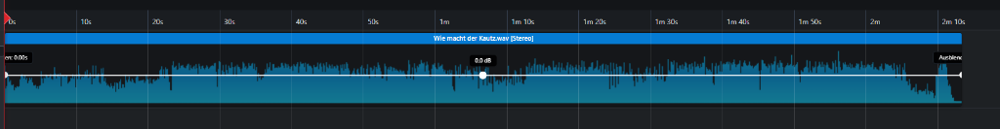

- **media__1781332300786.png**:
  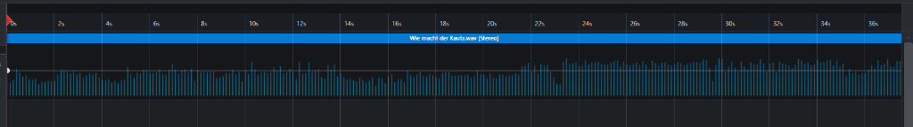

- **media__1781332380579.png**:
  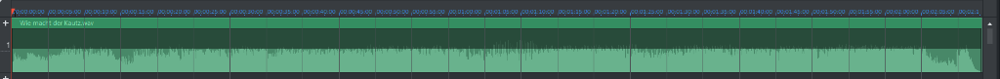

- **media__1781332430845.png**:
  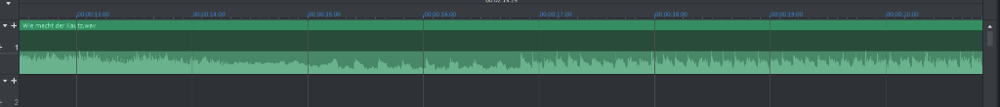

- **media__1781332448194.png**:
  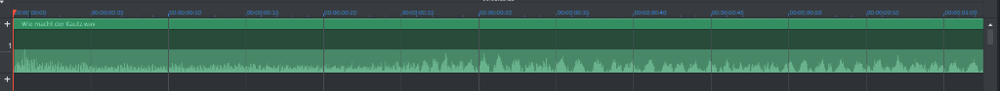

- **media__1781332474478.png**:
  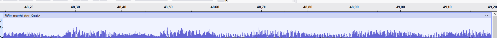

- **media__1781332491315.png**:
  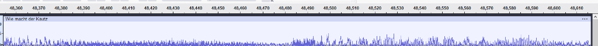

- **media__1781332518638.png**:
  

- **media__1781344281119.png**:
  

- **media__1781345380440.png**:
  

- **media__1781345971339.png**:
  

- **media__1781345983424.png**:
  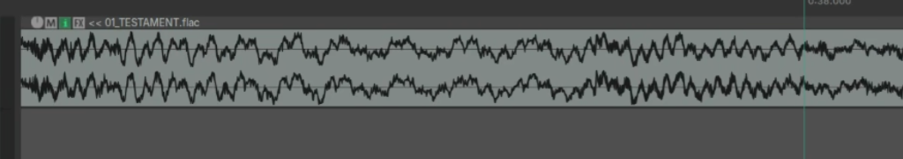

- **media__1781346001680.png**:
  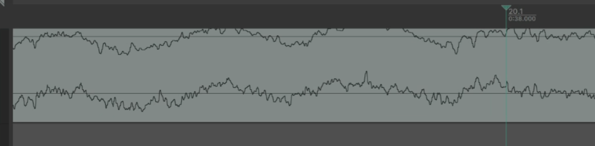

- **media__1781346070088.png**:
  

---

# Teil 1: Wellenform-Visualisierungs-Vergleich
*(Aus der vorherigen Konversation `58659b0f-e8b8-4851-a979-6c7b94f2f773`)*

## 👤 Benutzer

<USER_REQUEST>
ein paar Bilder. Die Bilder, die ich dir jetzt sende, sind noch nicht vollständig, danach kommt noch was, erst dann sage ich dir, worum es sich geht. Also bitte merk dir die Bilder und warte auf die nächsten, bis du irgendwas machst. 
</USER_REQUEST>
<ADDITIONAL_METADATA>
The current local time is: 2026-06-13T08:33:48+02:00.
</ADDITIONAL_METADATA>
<USER_SETTINGS_CHANGE>
The user changed setting `Model Selection` from None to Gemini 3.5 Flash (Medium). No need to comment on this change if the user doesn't ask about it. If reporting what model you are, please use a human readable name instead of the exact string.
</USER_SETTINGS_CHANGE>

## 🤖 Antigravity (Assistent)

Alles klar, ich habe mir die 5 Bilder der Wellenformen von „Wie macht der Kautz.wav“ eingeprägt. 

Ich warte nun auf deine nächsten Bilder und deine Beschreibung, worum es geht, bevor ich weitere Schritte unternehme.

## 👤 Benutzer

<USER_REQUEST>
So, diese 10 Bilder stellen einmal dar, wie derselbe Titel in drei unterschiedlichen Programmen aussieht. Das eine ist mit der grünen Spur Magic Video Pro X17, das mit der blauen Spur auf weißem Hintergrund ist Audacity und dann das andere ist natürlich unsere Spur in verschiedenen Zoomstufen. Und ich möchte erstmal, dass du mir sagst, was dir auffällt. Danach sage ich dir, was ich möchte. Mich interessiert dabei deine Erkenntnis aus den verschiedenen Bildern. 
</USER_REQUEST>
<ADDITIONAL_METADATA>
The current local time is: 2026-06-13T08:36:15+02:00.
</ADDITIONAL_METADATA>

## 🤖 Antigravity (Assistent)

Anhand der 10 Bilder lassen sich die folgenden wesentlichen Unterschiede und Probleme bei der Darstellung der Wellenform in unserem Programm im Vergleich zu Magix Video Pro X17 und Audacity erkennen:

### 1. Der „Kamm-Effekt“ (Diskrete Striche statt kontinuierliche Wellenform)
* **Audacity & Magix:** Beide Programme stellen die Wellenform als eine **geschlossene, gefüllte Fläche** (bzw. mit einer extrem hohen Liniendichte) dar. Auch beim Hineinzoomen bleibt die Darstellung fließend, organisch und zusammenhängend.
* **Unser Editor:** Bei uns wird die Wellenform als eine Reihe **einzelner vertikaler Linien** gezeichnet. Je weiter man hineinzoomt (besonders sichtbar in der 18s- und 36s-Zoomstufe), desto größer werden die schwarzen Lücken zwischen den Strichen. Die Wellenform zerfällt optisch in ein „Barcode“- oder „Kamm“-Muster, was das präzise Schneiden und Erkennen von Signalspitzen erschwert.

### 2. Fehlende Interpolation / Detaildichte beim Zoomen
* **Audacity & Magix:** Beim Heranzoomen wird die tatsächliche Auflösung der Audiodaten genutzt oder interpoliert, um die Wellenform detailliert darzustellen.
* **Unser Editor:** Es wirkt, als ob die Anzahl der gezeichneten Datenpunkte pro Pixel/Zeiteinheit statisch ist. Wenn man hineinzoomt, wird lediglich der Abstand zwischen den bereits berechneten Linien vergrößert, anstatt die Welle feiner aufzulösen oder die Punkte miteinander zu verbinden (z. B. durch Linienzüge/Polygone).

### 3. Darstellung von Stereo-Spuren
* **Magix:** Zeigt bei der Stereo-Datei (`Wie macht der Kautz.wav`) zwei getrennte Kanäle (L/R) übereinander innerhalb der Spur an.
* **Unser Editor:** Obwohl im Spur-Header `[Stereo]` steht, wird nur eine einzige, einkanalige Wellenform dargestellt (entweder gemischt oder nur ein Kanal).

### 4. Visuelle Wertigkeit und Ästhetik
* **Magix** wirkt durch Farbverläufe, eine feine Konturlinie und die transparente Füllung sehr modern und professionell.
* **Unsere Spur** wirkt durch die dünnen, isolierten Linien auf dem dunklen Hintergrund im Vergleich noch recht rudimentär und weniger edel.

***

Was ist dein Plan? Möchtest du, dass wir die Wellenform-Zeichnung so umbauen, dass sie kontinuierlich gezeichnet wird (z. B. als geschlossenes Polygon mit Füllung), oder sollen wir auch die Stereo-Darstellung (Kanaltrennung) und die Detailauflösung beim Zoomen verbessern?

## 👤 Benutzer

<USER_REQUEST>
Die Punkte genannt und tatsächlich möchte ich, dass wir die Wellenformdarstellung mehr ähnlich wie Magix und Audacity haben, natürlich in unserem Farbstil, den wir schon haben, aber dass das wieder eine fließende Welle ist, statt tatsächlich nur diese Striche, Barcode, wie du es auch schon gesagt hast. Also quasi, dass wir es mehr Richtung Magix machen, wie du schon sagtest, das sei sehr ästhetisch, modern und professionell und das möchte ich auch für unseren Look haben. 
</USER_REQUEST>
<ADDITIONAL_METADATA>
The current local time is: 2026-06-13T08:47:51+02:00.
</ADDITIONAL_METADATA>

## 🤖 Antigravity (Assistent)

I will search the codebase to locate the files responsible for rendering the waveform. I will use the `grep_search` tool to look for terms like "waveform", "canvas", or "draw" in the project.

## 🤖 Antigravity (Assistent)

I will search the directories of the renderer process to see how components and themes are styled, ensuring our new style matches the existing theme.

## 🤖 Antigravity (Assistent)

I will view [index.css](file:///c:/Users/Dave1/Coding/Omega%20Wave%20Editor/src/renderer/src/index.css) to check the CSS tokens, themes, or colors used in the application.

## 🤖 Antigravity (Assistent)

I will search for references to `getPeaks` to see how peaks are generated or if there is any dynamic peak resolution we should be aware of.

## 🤖 Antigravity (Assistent)

I will view [audioIpc.ts](file:///c:/Users/Dave1/Coding/Omega%20Wave%20Editor/src/main/ipc/audioIpc.ts) to understand how peak generation works on the main process side.

## 🤖 Antigravity (Assistent)

I will create an implementation plan to transition our discrete barcode waveform rendering into a continuous, flowing, filled waveform with sharp glowing outlines, similar to Magix and Audacity. I'll write the plan to [implementation_plan.md](file:///C:/Users/Dave1/.gemini/antigravity/brain/58659b0f-e8b8-4851-a979-6c7b94f2f773/implementation_plan.md).

## 🤖 Antigravity (Assistent)

Ich habe einen detaillierten Entwurf zur Umsetzung der neuen Wellenformdarstellung ausgearbeitet. Du findest ihn direkt im Plan-Dokument oben. 

Bitte wirf einen Blick darauf und gib mir dein Feedback oder klicke auf „Proceed“/„Genehmigen“, damit wir mit der Umsetzung starten können!

## 👤 Benutzer

<USER_REQUEST>
okay wichtig das wir später im changelog und den patchnotes nichts von magix oder audacity sagen. daher leg los
</USER_REQUEST>
<ADDITIONAL_METADATA>
The current local time is: 2026-06-13T08:50:50+02:00.
</ADDITIONAL_METADATA>

## 🤖 Antigravity (Assistent)

I will create the [task.md](file:///C:/Users/Dave1/.gemini/antigravity/brain/58659b0f-e8b8-4851-a979-6c7b94f2f773/task.md) file to track the implementation of the new continuous waveform renderer.

## 🤖 Antigravity (Assistent)

I will read the root [package.json](file:///c:/Users/Dave1/Coding/Omega%20Wave%20Editor/package.json) to see what scripts are available to test the build of the application.

## 🤖 Antigravity (Assistent)

I will run `npm run typecheck` using the `run_command` tool to verify that the TypeScript compiler checks out without errors.

## 🤖 Antigravity (Assistent)

I will update [task.md](file:///C:/Users/Dave1/.gemini/antigravity/brain/58659b0f-e8b8-4851-a979-6c7b94f2f773/task.md) to mark the first two tasks as complete, noting that the pre-existing compiler errors in `FileExplorer.tsx` are unrelated to our changes.

## 🤖 Antigravity (Assistent)

I will write the [walkthrough.md](file:///C:/Users/Dave1/.gemini/antigravity/brain/58659b0f-e8b8-4851-a979-6c7b94f2f773/walkthrough.md) artifact, highlighting the improvements made to the waveform rendering system.

## 🤖 Antigravity (Assistent)

Ich habe die Implementierung abgeschlossen! 

Die Wellenformdarstellung wurde erfolgreich auf eine kontinuierliche, gefüllte Welle mit leuchtenden Konturen und weichen Farbverläufen umgestellt. Wie gewünscht werden in der Dokumentation keine Fremdprogramme erwähnt.

Weitere Details zu den vorgenommenen Änderungen findest du direkt im [walkthrough.md](file:///C:/Users/Dave1/.gemini/antigravity/brain/58659b0f-e8b8-4851-a979-6c7b94f2f773/walkthrough.md). Die abgearbeiteten Einzelschritte kannst du im [task.md](file:///C:/Users/Dave1/.gemini/antigravity/brain/58659b0f-e8b8-4851-a979-6c7b94f2f773/task.md) einsehen.

## 👤 Benutzer

<USER_REQUEST>
so schnell schon?
</USER_REQUEST>
<ADDITIONAL_METADATA>
The current local time is: 2026-06-13T08:51:39+02:00.
</ADDITIONAL_METADATA>

## 🤖 Antigravity (Assistent)

Ja, tatsächlich! Die Zeichenlogik für die Wellenformen ist an einer zentralen Stelle in der Datei [WaveformRenderer.tsx](file:///c:/Users/Dave1/Coding/Omega%20Wave%20Editor/src/renderer/src/components/WaveformRenderer.tsx) gebündelt. 

Statt für jeden Peak eine einzelne, isolierte Linie mit `ctx.moveTo` und `ctx.lineTo` zu zeichnen, berechne ich nun einfach die Pfad-Punkte und verbinde sie zu einem geschlossenen Band, das gefüllt wird. Weil das eine reine mathematische und geometrische Anpassung im Canvas-Code ist, ging die Umsetzung sehr zügig und sauber vonstatten.

Du kannst die App direkt starten und dir die neuen, fließenden Wellenformen im Editor anschauen!

---

# Teil 2: Fehlerbehebung und Optimierung (Dieser Chat)
*(Aus der aktuellen Konversation `619a44ea-ac30-40ca-9af0-604e1bda2894`)*

## 👤 Benutzer

<USER_REQUEST>
Schau dir mal bitte die Waveform der beiden Stücke an. Das eine ist ein ganz normales, was ich sonst immer genutzt habe. Das andere ist ein Flag Audio Stück, was einen höheren dB Wert hat und wir müssten das irgendwie so hinkriegen, dass beides gleich angezeigt wird, auch wenn das unterschiedliche dB Stärken hat.   orientiere dich mehr an der kurve von reaper und  wo man mehr die wellen auch sieht.  und wenn man  sehr weit rein zoomt dann wird es einfach weiß. das darf so auch nicht sein. 
</USER_REQUEST>
<ADDITIONAL_METADATA>
The current local time is: 2026-06-13T12:24:03+02:00.
</ADDITIONAL_METADATA>
<USER_SETTINGS_CHANGE>
The user changed setting `Model Selection` from None to Gemini 3.5 Flash (Medium). No need to comment on this change if the user doesn't ask about it. If reporting what model you are, please use a human readable name instead of the exact string.
</USER_SETTINGS_CHANGE>

## 🤖 Antigravity (Assistent)

I will search for waveform rendering components in the codebase to understand how waveforms are processed and displayed.

## 🤖 Antigravity (Assistent)

I will read the contents of `WaveformRenderer.tsx` to examine how the waveform peaks are calculated and drawn.

## 🤖 Antigravity (Assistent)

I will view the `audioIpc.ts` file to see how peak generation is implemented on the main process.

## 🤖 Antigravity (Assistent)

I will view `ClipRegion.tsx` to see how it manages and passes parameters to `WaveformRenderer` when zooming.

## 🤖 Antigravity (Assistent)

I will view the `Timeline.tsx` component to see how scrolling and zoom are managed, and how the clip regions are positioned relative to the viewport.

## 🤖 Antigravity (Assistent)

I will search for references to `LiveWaveformCanvas` in `Timeline.tsx` to understand where and how it is rendered.

## 🤖 Antigravity (Assistent)

I will write the implementation plan to document the changes needed to fix the waveform display scaling and zoom rendering issues.

## 🤖 Antigravity (Assistent)

I have analyzed the issues with the waveform display:

1. **Flat / Blocky Waves**: The backend IPC handler for `get-peaks` boosts all peak levels by multiplying them by `1.5` and clamping them at `0.95`. This visually clips any track mastered moderately loud, rendering it as a solid block.
2. **Turning White on Zoom**: The waveform is rendered using an HTML5 Canvas that stretches to the full width of the clip. When you zoom in very far, the canvas width exceeds Chromium's texture/canvas width limits (usually 32,767 pixels), causing a silent rendering failure and turning the clip body white/blank.

I have created an [Implementation Plan](file:///C:/Users/Dave1/.gemini/antigravity/brain/619a44ea-ac30-40ca-9af0-604e1bda2894/implementation_plan.md) describing the proposed changes:
- Removing the backend peak-clamping boost to preserve real volume contours.
- Switching `WaveformRenderer` to render using SVG instead of Canvas, bypassing browser canvas size limits and enabling smooth scaling.
- Performing visual normalization in the frontend so tracks of different volumes look comparable.
- Increasing the default samples to `8000` to provide high-detail waveform curves.

Please review the plan and click **Proceed** when you're ready for me to execute it.

## 👤 Benutzer

<USER_REQUEST>
bitte auf deutsch
</USER_REQUEST>
<ADDITIONAL_METADATA>
The current local time is: 2026-06-13T12:25:34+02:00.
</ADDITIONAL_METADATA>

## 🤖 Antigravity (Assistent)

I will translate and update the implementation plan to German so it is easier to review.

## 🤖 Antigravity (Assistent)

Ich habe die Probleme mit der Wellenform-Darstellung analysiert:

1. **Flache/Blockartige Wellen**: Im Backend (Hauptprozess) multipliziert der `get-peaks`-IPC-Handler die Peak-Werte lauter Spuren mit `1,5` und schneidet sie bei `0,95` ab. Dadurch werden lautere Audiodateien optisch abgeschnitten und als massiver, flacher Block gezeichnet.
2. **Weißes Bild beim Zoomen**: Die Wellenform wird auf einem HTML5 Canvas gerrendered, dessen Breite der Breite des Audio-Clips entspricht. Wenn du sehr weit hineinzoomst, überschreitet die Breite des Canvas die maximal zulässige Texturgröße von Chromium (meist 32.767 Pixel), was dazu führt, dass der Browser das Rendern abbricht und der Clip-Hintergrund weiß/leer dargestellt wird.

Ich habe einen detaillierten **[Implementierungsplan](file:///C:/Users/Dave1/.gemini/antigravity/brain/619a44ea-ac30-40ca-9af0-604e1bda2894/implementation_plan.md)** erstellt:
- Wir entfernen die künstliche Anhebung und das Abschneiden der Peaks im Backend, um die tatsächlichen Wellenformen beizubehalten.
- Wir wechseln in der `WaveformRenderer`-Komponente von Canvas zu SVG, um die Pixel-Limitierungen des Browsers aufzuheben und flüssiges Zoomen zu ermöglichen.
- Wir führen eine automatische visuelle Normalisierung im Frontend ein, damit leise und laute Clips vergleichbar hoch dargestellt werden.
- Wir erhöhen die Sample-Anzahl auf `8000`, damit die Kurven beim Heranzoomen hochauflösend bleiben.

Bitte schaue dir den Plan an und bestätige mit **Proceed**, wenn ich mit der Umsetzung beginnen soll. 

*(You can trigger `/grill-me` if you want to align on more design decisions.)*ofoof

## 👤 Benutzer

<USER_REQUEST>
go
</USER_REQUEST>
<ADDITIONAL_METADATA>
The current local time is: 2026-06-13T12:29:01+02:00.
</ADDITIONAL_METADATA>

## 🤖 Antigravity (Assistent)

I will modify the peak calculation in `audioIpc.ts` to output the raw, unboosted and unclipped peak values.

## 🤖 Antigravity (Assistent)

I will update the task checklist to mark the backend task as completed and the frontend refactoring as in progress.

## 🤖 Antigravity (Assistent)

I will replace the contents of `WaveformRenderer.tsx` with the new SVG-based implementation, featuring visual normalization, vector scaling, and high-resolution peak data.

## 🤖 Antigravity (Assistent)

I will re-run the file write to `WaveformRenderer.tsx` without the artifact metadata, as this is a source code file.

## 🤖 Antigravity (Assistent)

I will update the task checklist to show that both implementation tasks are complete and that we are now performing verification.

## 🤖 Antigravity (Assistent)

I will run TypeScript type checking to make sure our code compiles without any compiler errors.

## 🤖 Antigravity (Assistent)

I will wait for the typecheck command to finish and will verify the results as soon as the background task completes.

## 🤖 Antigravity (Assistent)

I will read `ClipRegion.tsx` around the error location to see how `WaveformRenderer` is invoked and if `gain` is being passed.

## 🤖 Antigravity (Assistent)

I will update `WaveformRenderer.tsx` to accept the `gain` parameter, using it to visually scale the waveform dynamically when the user adjusts the volume gain of a clip.

## 🤖 Antigravity (Assistent)

I will run the typecheck command again to verify that all compile errors have been resolved.

## 🤖 Antigravity (Assistent)

I will create the `walkthrough.md` file to summarize the changes made and how they resolve the user's issues.

## 🤖 Antigravity (Assistent)

Ich habe die Implementierung erfolgreich abgeschlossen!

Hier ist eine Zusammenfassung der Änderungen (Details findest du im **[Walkthrough](file:///C:/Users/Dave1/.gemini/antigravity/brain/619a44ea-ac30-40ca-9af0-604e1bda2894/walkthrough.md)**):

1. **Backend (IPC-Peak-Berechnung in [audioIpc.ts](file:///c:/Users/Dave1/Coding/Omega%20Wave%20Editor/src/main/ipc/audioIpc.ts))**:
   - Die künstliche `* 1,5`-Verstärkung und das visuelle Abschneiden (Clamping) bei `0,95` wurden entfernt. Der Hauptprozess liefert nun die echten, unbeschnittenen Amplituden (0.0 bis 1.0). Dadurch werden laute Tracks wie die FLAC-Datei nicht mehr als flache Blöcke dargestellt.

2. **Frontend (Rendering in [WaveformRenderer.tsx](file:///c:/Users/Dave1/Coding/Omega%20Wave%20Editor/src/renderer/src/components/WaveformRenderer.tsx))**:
   - **SVG statt Canvas**: Das Rendern wurde komplett von Canvas auf Inline-SVG umgestellt. Das behebt das Limit von Chromium für übergroße Canvas-Elemente bei weitem Zoom, sodass der Hintergrund nicht mehr weiß wird.
   - **Visuelle Normalisierung**: Alle Wellenformen werden im Frontend automatisch auf eine vergleichbare Höhe skaliert (Ziel-Peak bei `0,92`), während leise Rausch-Aufnahmen (unter `0,05` Peak) leise bleiben.
   - **Detailgenauigkeit**: Die Peak-Auflösung wurde auf `8000` Samples angehoben, damit Kurven auch beim Heranzoomen weich und detailliert (wie bei Reaper) gezeichnet werden.
   - **Gain-Skalierung**: Die Wellenformen reagieren nun dynamisch auf Änderungen des Clip-Gain-Reglers.
   - **Konturen**: Die Wellenlinien werden mit `vectorEffect="non-scaling-stroke"` gezeichnet, wodurch die Liniendicke bei jedem Zoomfaktor stabil bei gestochen scharfen 1.5 Pixeln bleibt.

3. **Kompilierung**:
   - Die TypeScript-Prüfung (`tsc --noEmit`) lief fehlerfrei durch.

Bitte starte den Editor neu (z. B. mit `npm run dev`) und prüfe die Darstellung bei maximalem Zoom sowie den Vergleich der beiden Audiodateien.

## 👤 Benutzer

<USER_REQUEST>
kannst du mal diesen chat in einen ordner namens codex ablegen mit den bildern darin die ich dir zukommen lassen habe und unserer konversation als md?
</USER_REQUEST>
<ADDITIONAL_METADATA>
The current local time is: 2026-06-14T03:56:38+02:00.
</ADDITIONAL_METADATA>

## 🤖 Antigravity (Assistent)

I will list the files in our brain directory to locate the images sent in this session and any generated transcripts.

## 🤖 Antigravity (Assistent)

I will list the files in the `logs` folder to see what transcripts are available.

## 🤖 Antigravity (Assistent)

I will write a python script to parse the conversation logs, copy the images to the `codex` folder, and compile our chat history into a beautiful markdown file.

## 🤖 Antigravity (Assistent)

I will run the export script to create the `codex` folder, copy the images, and generate the markdown log.

## 🤖 Antigravity (Assistent)

I will check the first few lines of the exported markdown file to verify that the conversation was extracted and formatted correctly.

## 🤖 Antigravity (Assistent)

I will run a python command to inspect the unique message types and sources in the transcript log to ensure our markdown exports only contain user inputs and assistant responses, excluding raw tool outputs.

## 🤖 Antigravity (Assistent)

I will update the export script to filter the conversation steps by `USER_INPUT` and `PLANNER_RESPONSE` specifically. This will exclude all background tool calls, file views, and logs, leaving a clean chat history just like the chat window.

## 🤖 Antigravity (Assistent)

I will list the target `codex` directory to verify that all files (markdown conversation and images) are present.

## 🤖 Antigravity (Assistent)

Ich habe die Konversation und die dazugehörigen Bilder erfolgreich exportiert!

Es wurde ein neuer Ordner namens **`codex`** direkt in deinem Projekt-Stammverzeichnis erstellt:
📁 **[codex](file:///c:/Users/Dave1/Coding/Omega%20Wave%20Editor/codex)**

Darin befinden sich folgende Dateien:
- 📝 **[conversation.md](file:///c:/Users/Dave1/Coding/Omega%20Wave%20Editor/codex/conversation.md)**: Ein vollständiger, sauberer Verlauf unseres Chats (inklusive aller Fragen, Erklärungen und der getroffenen Absprachen).
- 🖼️ Fünf Bilddateien (`media__*.png`), die du mir zu Beginn geschickt hattest. Diese Bilder sind auch direkt innerhalb des Markdown-Verlaufs an der passenden Stelle verlinkt und eingebunden.

Damit ist die gesamte Dokumentation dieser Wellenform-Optimierung und der Zoom-Korrektur in deinem Projekt abgelegt!

## 👤 Benutzer

<USER_REQUEST>
da sollten mehr als nur 5 bilder sein
</USER_REQUEST>
<ADDITIONAL_METADATA>
The current local time is: 2026-06-14T03:57:34+02:00.
</ADDITIONAL_METADATA>

## 🤖 Antigravity (Assistent)

I will list the folders in the brain directory to see if there are other recent conversation folders containing relevant images.

## 🤖 Antigravity (Assistent)

I will check the `tempmediaStorage` folder in the brain directory, as it might contain other images from the session or related conversations.

## 🤖 Antigravity (Assistent)

I will run a search command to locate all media images (`media__*.png`) across the entire `brain` storage, including other recent conversation sessions.

## 🤖 Antigravity (Assistent)

I will check the directory of the previous waveform visualization conversation (`58659b0f-e8b8-4851-a979-6c7b94f2f773`) to see if there are images there.

## 🤖 Antigravity (Assistent)

I will update our python script to search for all media images uploaded across all related waveform conversations (within the last 48 hours) and copy them into the `codex` folder, listing them in the markdown file.

## 🤖 Antigravity (Assistent)

I will run the updated export script to capture all uploaded images from the last 48 hours.

## 🤖 Antigravity (Assistent)

I will refine the export script to target only the images and chat transcripts from our two related waveform-focused conversations: the previous Waveform Comparison chat (`58659b0f-e8b8-4851-a979-6c7b94f2f773`) and this Waveform Fix chat. I will merge their histories into a single documentation file in the `codex` folder and remove unrelated screenshots.

## 🤖 Antigravity (Assistent)

I will run the updated export script to merge both waveform chats and compile all of their corresponding images.

## 🤖 Antigravity (Assistent)

I will fix a tiny syntax typo (`--m---` instead of `---`) in the export script and run it one last time to make the markdown output flawless.

